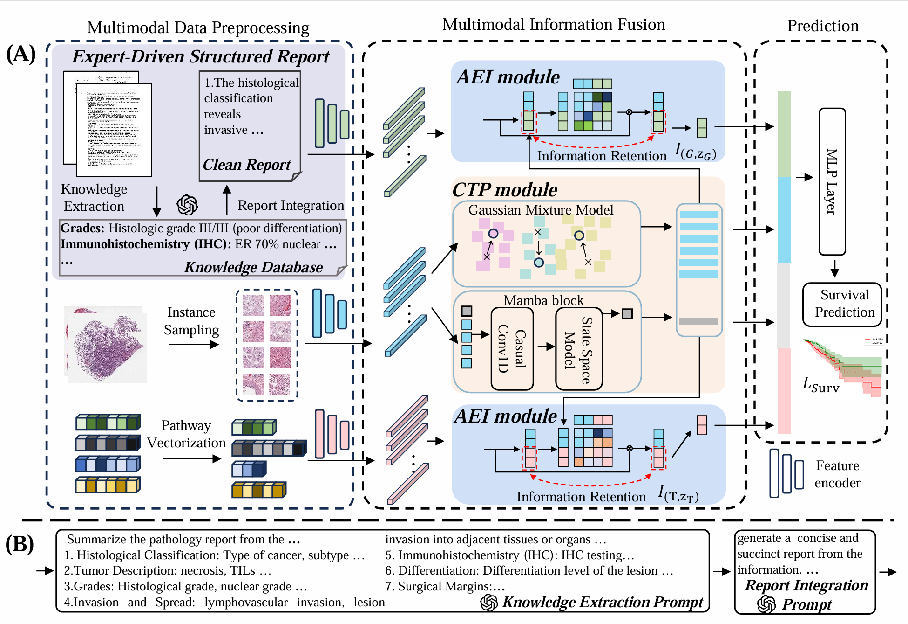

<div align="center">
<h1>TMSE: Tri-Modal Survival Estimation with Context-aware Tissue Prototype and Attention-Entropy Interaction</a></h1>
</div>


This repository is the official implementation of **TMSE**. 


## Table of Contents
- [Overview](#Overview)
- [Data preparation](#data-preparation)
- [Requirements](#requirements)
- [Training & Testing](#training--testing)

## Overview



**Abstract:** Survival prediction plays a crucial role in clinical decision-making, enabling personalized treatments by integrating multi-modal medical data, such as histopathology images, pathology reports, and genomic profiles. However, the heterogeneity across these modalities and the high dimensionality of Whole Slide Images (WSI) make it challenging to capture survival-relevant features and model their interactions. Existing methods, typically focused on single-modal WSI, fail to leverage multimodal information, such as expert-driven pathology reports, and struggle with the computational complexity of WSI. To address these issues, we propose a novel **T**ri-**M**odal **S**urvival **E**stimation framework (TMSE), which includes three components: (1) Pathology report processing pipeline, curated with expert knowledge, with both the pipeline and the processed structured report being publicly available;  (2) Context-aware Tissue Prototype (CTP) module, which uses Mamba and Gaussian mixture models to extract compact, survival-relevant features from WSI, reducing redundancy while preserving histological details; (3) Attention-Entropy Interaction (AEI) module, a attention mechanism enhanced with entropy-based optimization to align and fuse three modalities: WSI, pathology reports, and genomic data. Extensive evaluation on three TCGA datasets (BLCA, BRCA, LUAD) shows that our approach achieves superior performance in survival prediction.


## Data Preparation

### WSIs
We preprocess whole slide image (WSI) data using [CLAM](https://github.com/mahmoodlab/CLAM), which provides an easy-to-use tool for WSI preprocessing. For detailed guidance, we highly recommend referring to the [Tutorial - Processing WSIs for MIL from Scratch](https://github.com/liupei101/Pipeline-Processing-TCGA-Slides-for-MIL).

 We use [PLIP](https://github.com/PathologyFoundation/plip) as the patch-level feature encoder and store the extracted features in the `/path/to/data_source` directory.

### Genomics
Pathway data can be downloaded from [MMP](https://github.com/mahmoodlab/MMP) and should be placed in the `data_csv/rna` folder.

### Text Reports
To advance pathology research, we publicly release a curated dataset of approximately 10K TCGA reports. We utilize a commercial LLM to refine the original reports for better quality. The cleaned reports and the prompts used in the cleaning process are available in the `text_report` folder. The original TCGA reports can be accessed from [TCGA Path Reports](https://github.com/tatonetti-lab/tcga-path-reports).  

For text feature encoding, we employ [BiomedBERT](https://huggingface.co/microsoft/BiomedNLP-BiomedBERT-base-uncased-abstract-fulltext), with extracted features stored in the `/path/to/text_embeddings` directory.

### Data Split
We adopt the same data split strategy as [MMP](https://github.com/mahmoodlab/MMP). You may modify and use your own data split file at `"/path/to/data_splits/k=${k}"`.

## Requirements

Install all required packages by running:
```shell
pip install -r requirements.txt
```

## Training & Testing

### 0. Navigate to the appropriate directory
```bash
cd src_TMSE
```

### 1. Generate Gaussian prototypes for each WSI
Run the following bash script and specify the required arguments:
```bash
bash ./scripts/prototype/blca.sh gpu_id
```

### 2. Train and validate TMSE to reproduce the results in the paper
Run the following bash script and specify the required arguments:
```bash
bash ./scripts/survival/blca_surv.sh gpu_id TMSE
```


